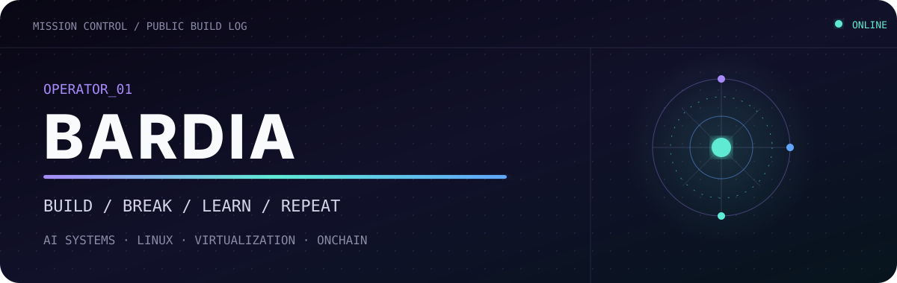
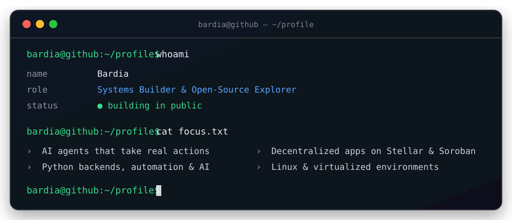
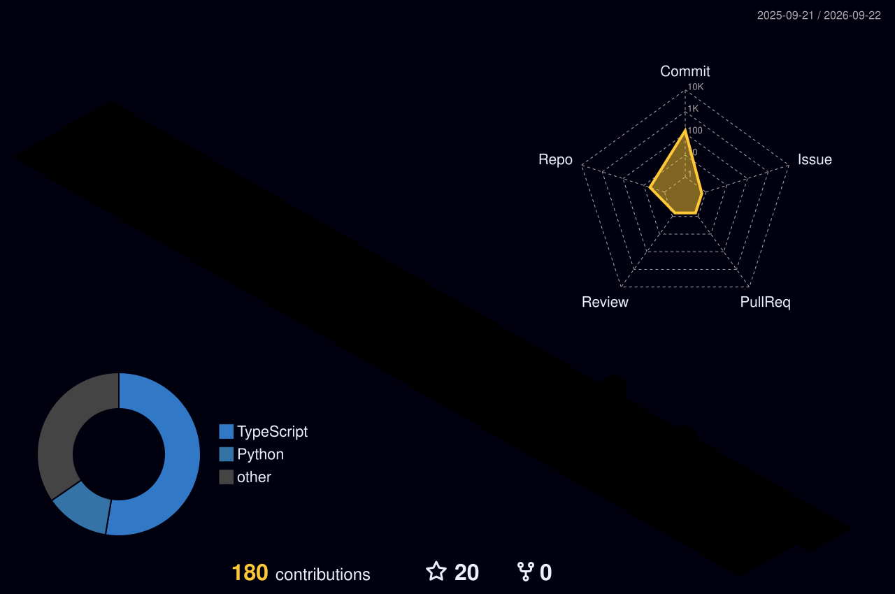

<div align="center">



<br />

[](https://git.io/typing-svg)

[](https://x.com/bybardiia)
[](https://linktr.ee/bybardia)
[](https://github.com/bybardia?tab=followers)
[](https://github.com/bybardia)

</div>

## `01 // About`

I learn by pulling systems apart, understanding the layers, and building something better from what I find.

<div align="center">



</div>

- 🐍 I use **Python** to automate, prototype, and build intelligent systems.
- 🐧 I am comfortable working in **Linux environments** and at the system layer.
- 🖥️ I work with **virtual machines, virtualization, and isolated environments**.
- 🤖 I build with **AI models, agents, structured outputs, and tool integrations**.
- ⚡ I use AI-assisted workflows to move rapidly from an idea to a working product.
- 🌐 I experiment with **smart contracts and decentralized applications**.

## `02 // Selected builds`

<table>
<tr>
<td width="50%" valign="top">

### 🛡️ [Aegis](https://github.com/bybardia/aegis-support-agent)

**Trust-gated AI support agent**

A multi-agent pipeline that grounds replies in policy, evaluates its own output, reflects when confidence is low, and deterministically escalates risky cases.

`Python` `Gemini` `MCP` `Pydantic`

</td>
<td width="50%" valign="top">

### 🌊 [Aqua](https://github.com/bybardia/aqua-money-streaming)

**Real-time money streaming**

An onchain application for streaming payments per second — designed for salaries, subscriptions, and vesting on Stellar Soroban.

`TypeScript` `Next.js` `Stellar` `Soroban`

</td>
</tr>
<tr>
<td width="50%" valign="top">

### 📊 [Stellar Live Poll](https://github.com/bybardia/stellar-live-poll)

**Real-time onchain polling**

A multi-wallet polling experience backed by a Soroban smart contract on Stellar Testnet.

`Rust` `Soroban` `Next.js`

</td>
<td width="50%" valign="top">

### 💸 [Stellar Payment dApp](https://github.com/bybardia/stellar-next-payment-dapp)

**Simple testnet payments**

A clean payment flow built with Freighter Wallet, Next.js, and the Stellar SDK.

`TypeScript` `Next.js` `Stellar SDK`

</td>
</tr>
</table>

## 03 // Stack

<table>
  <tr>
    <td align="center" valign="top">
      <sub><b>SYSTEMS &amp; TOOLS</b></sub>
      <br><br>
      <table>
        <tr>
          <td align="center" width="90"><br><sub>Linux</sub></td>
          <td align="center" width="90"><br><sub>Bash</sub></td>
          <td align="center" width="90"><br><sub>Docker</sub></td>
        </tr>
        <tr>
          <td align="center" width="90"><br><sub>Git</sub></td>
          <td align="center" width="90"><br><sub>GitHub</sub></td>
          <td align="center" width="90"></td>
        </tr>
      </table>
    </td>
    <td align="center" valign="top">
      <sub><b>LANGUAGES &amp; FRAMEWORKS</b></sub>
      <br><br>
      <table>
        <tr>
          <td align="center" width="90"><br><sub>Python</sub></td>
          <td align="center" width="90"><br><sub>TypeScript</sub></td>
          <td align="center" width="90"><br><sub>Rust</sub></td>
          <td align="center" width="90"><br><sub>Next.js</sub></td>
        </tr>
        <tr>
          <td align="center" width="90"><br><sub>Java</sub></td>
          <td align="center" width="90"><br><sub>HTML</sub></td>
          <td align="center" width="90"><br><sub>CSS</sub></td>
          <td align="center" width="90"></td>
        </tr>
      </table>
    </td>
    <td align="center" valign="top">
      <sub><b>ONCHAIN</b></sub>
      <br><br>
      <table>
        <tr>
          <td align="center" width="90"><br><sub>Stellar</sub></td>
          <td align="center" width="90"><br><sub>Soroban</sub></td>
        </tr>
      </table>
    </td>
  </tr>
</table>

## `04 // Signal`

<div align="center">



</div>
---

<div align="center">

```text
[ STATUS: BUILDING ]  [ MODE: CURIOUS ]  [ NEXT: SHIP IT ]
```

**Learning how systems work — then building better ones.**

</div>
